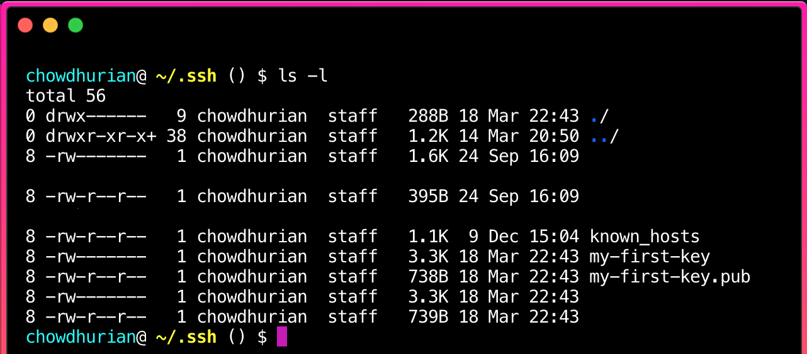

_First published on [26th March 2019 via Medium](https://medium.com/press-start-to-begin/anyone-can-ssh-into-a-server-scp-files-from-it-set-up-your-own-vpn-or-all-of-the-above-471a06e310bd)._

**A good way** to learn is to make a useful thing with whatever you're trying to learn.

One useful thing for me was set up my own VPN or Virtual Private Network. My work machines have VPN set up for security in case the network I connect to is compromised. Let's face it: public wifi isn't safe. Public wifi is untrustworthy; VPNs are important unless you're connected to a wifi network you have set up yourself or one that you trust. I wanted the same thing for my personal machine.

I could buy a subscription (if you want a recommendation, comment below and I'll link you). My partner is a nomad and they tend to use wifi where they can get it. I recommended they use a subscription service, which I've used before, to get started with minimum fuss.

But needing a VPN was a great reason to try out OpenVPN! So, we're going to learn how to ssh into a server and copy files off of it, by setting up our own VPN. I do my best to be transparent and explain what's going on, but I encourage you to search if you want to dig deeper! Spend about 15 minutes skimming the guide to get an idea of what it will ask of you.

Note that this guide will be easier to follow if you're using MacOS or Linux. You may need to find substitutes to the command line tools if you're using Windows. I'm sorry, I don't yet have a Windows machine to try this on! 🙏🏽

## First, here are your tools

We're going to use a few command line tools.

`ssh` lets you securely connect to a remote server from your command line.

`scp` lets you transfer data back and forth between your machine and the server.

`pbcopy` puts stuff on the clipboard.

Pipe ( `|` ) passes stuff produced by one command to another command.

## Now, we're going to…

1. 🔑 Generate an ssh key
2. 🔌 Power up a virtual private server, and add your ssh key
3. 👩🏽‍💻 ssh into your very own server
4. ⬇️ Download a script to your server, and run it
5. 🔎 Copy the config file from the server to your machine
6. 🔓 Download an OpenVPN client, add the config file and connect to your VPN

Ready?! Ok, let's start by opening up your command line emulator. Terminal is the default on Mac. But you can use any emulator that you want.

### 1. 🔑 Generate an ssh key

We're going to use ssh-keygen to generate an SSH key. This SSH key will let you log into your server through the command line without having to use a password. We'll be adding this key to the server you spin up later in **Step 2**.

We're going to run `ssh-keygen -t rsa -b 4096 -C my-first-key`.

💁🏽‍♀️ This is what the above line means:

The option `-t` lets you specify RSA as the cryptosystem to be used to generate your keys.

The option `-b` lets you choose how long you want the key to be. We'll go for 4096 bits.

`-C` let's you specify `my-first-key` as a comment to be inserted when you create your key, and also helps name the file.

Bonus! Run `man ssh-keygen` and you'll find a detailed list of all the possible options.

Deep dive done, back to the guide. Type or copy `ssh-keygen -t rsa -b 4096 -C my-first-key` into your command line then run it.

The command line will ask you for a file name. To keep things simple, enter the same name you used for the comment: "my-first-key", and press enter.

When it asks for a passphrase, leave it empty and press enter. Confirm when it asks again.

Congratulations, you now have an ssh key!

Now make sure you're in the `~/.ssh` directory by running `pwd`. If not, change directory into that with: `cd ~/.ssh`

Run `ls -l` to see what files you have in there. `my-first-key` and `my-first-key.pub` should be present.

Next we'll choose a virtual private server (Digital Ocean, Vultr, Linode, etc.) and set it up with your new SSH key.

### 2. 🔌 Power up a virtual private server (VPS), and add your ssh key

We'll walk though Digital Ocean here (although you can use any VPS that fits your needs). I've also used Vultr, which is solid. I'd recommend choosing a pricing tier with at least 500GB in data transfer. That's going to be on the low end. Expect to spend about USD 5. If you don't have an account yet, feel free to use this [referral link](https://m.do.co/c/57563068d2f7) to sign up.

On Digital Ocean, they call virtual machines a Droplet. So let's set up your Droplet.

I'll help you choose the specifications for your VPN now.

When it asks to choose an image, pick the latest Ubuntu or the Ubuntu with the highest number.

It'll ask to choose a plan. Look for the arrow on the left.

Click that arrow (circled in purple) until you see an option that has at least 500GB in transfer. That way you're unlikely to go over, even with all your internet traffic going through your new VPN. But watch your transfer consumption through the Dashboard later!

Well done, you're almost done with this step!

Skip everything until you see a choice of data centre regions. This is important, as your VPN connection speed is typically the fastest (and has the lowest latency) when it's geographically closer to you. So pick the one that's nearest to where you are.

Now you'll need to copy your SSH key and add it.

Go back to your command line. Type in `cat my-first-key.pub | pbcopy` and hit enter.

💁🏽‍♀️ Here is what that command does:

`cat` reads the text of the file to standard output. We're using pipe ( `|` ) to pass that output to another command. `pbcopy` copies that output.

Now you can paste the content of "my-first-key.pub" like you would anywhere else.

Go back to the Digital Ocean setup screen in your browser. Let's add your keys by pasting the content you just copied.

Click the button to add a new key. A text box will appear. Paste into the textbox the copied content from the command you ran earlier, using Command-V (Cmd ⌘-V) on MacOS or your own keybinding on your OS.

A very long set of characters should appear in the text box. Name it "my-first-key" and save.

Copy the IP address of the server you just created! You'll need it soon 😄

Copy (using the helpful "copy" link) the IP address from your project's resources page.In case you're looking for more detail, this is Digital Ocean's [extensive guide](https://www.digitalocean.com/docs/droplets/how-to/create/) to setting up your Droplet. They write good docs! 🦈

### 3. 👩🏽‍💻 ssh into your very own server

Type or copy `ssh -i ~/.ssh/my-first-key root@333.22.22.333` (where 333.22.22.333 is the IP you copied from the VPS web interface) into the command line and run it.

💁🏽‍♀️ Here's what that command is doing:

`ssh` is the command.

`-i` is the option for _identity file_ and lets you pass the path to your private key which lets you access your server.

`~/.ssh/my-first-key` is the path to the private key file that you created in Step 1 using `ssh-keygen`.

`root` gives your root user access.

`333.22.22.333` is the placeholder for the IP address of the server you created and whose IP address you copied from the browser. Replace it with that IP address, from the end of Step 2.

The command line will ask to verify that you want to continue connecting. Type `yes`, hit enter.

When you see text welcoming you to Ubuntu…congratulations, you're in!

This was a quicker step 😉

### 4. ⬇️ Download a script to your server and run it

We're going to hit up the wonderful world of open source and use [a super helpful setup script](https://github.com/Angristan/OpenVPN-install) to install OpenVPN! 🎉

You can read through the [README](https://github.com/angristan/openvpn-install/blob/master/README.md) for really helpful details on the what the script does for you. The steps to actually use it are quick, so we'll walk through those here.

First we'll download the script. In your command line, run:

`curl -O https://raw.githubusercontent.com/Angristan/openvpn-install/master/openvpn-install.sh`

Now let's make the script we downloaded executable, with:

`chmod +x openvpn-install.sh`

That means we can run the script, by running this:

`./openvpn-install.sh`

To accept the default choices, which is recommended by the script's maintainer, press enter every time you're prompted.

At one stage, it will ask you to type in a name with no special characters. This can be whatever your want, but for this guide we'll type _hellovpn_ and press enter.

The setup script will generate an .opvn file. This file is a configuration file: it's what you will use to connect from your machine to the server you just set up!

### 5. 🔎 Copy the config file from the server to your machine

You'll need to get the .opvn file onto your machine. To do that, run:

`scp -i ~/.ssh/my-first-key root@333.22.22.333:~/hellovpn.ovpn ~/.`

💁🏽‍♀️ Here's what this command does:

`scp` is the command to connect to the server and copy the file.

`-i` is the option for identity file, just like in the `ssh` command!

`root` gives your root user access, again like with `ssh`.

`333.22.22.333` is the placeholder for the IP address of the server you created. Replace it with the IP address of your own server from the end of Step 2.

`~/hellovpn.ovpn` is the path to the config file that was created by the script, which we want to download to our machine.

`~/.` is the path to the directory where we want to save the file, here the home directory.

When you run the command, the .ovpn file should be saved to your home directory!

### 6. 🔓 Download an OpenVPN client, add the config file and connect to your VPN

On MacOS, I use [Tunnelblick](https://tunnelblick.net/). On Android, I use [OpenVPN for Android](https://play.google.com/store/apps/details?id=de.blinkt.openvpn).

Install the client. Follow the client's instructions to add the .ovpn file to it.

Use the file to set up your client and connect!

## Done!

To recap, this is what you did! You:

1. 🔑 Generated an ssh key
2. 🔌 Powered up a virtual private server, and add your ssh key
3. 👩🏽‍💻 ssh'd into your very own server
4. ⬇️ Downloaded a script to your server, and run it
5. 🔎 Copied the config file from the server to your machine
6. 🔓 Downloaded an OpenVPN client, add the config file and connect to your VPN

**If you did any of the above for the first time, yay! I wrote this mainly for you and I hope you liked it.**

To my friend, [Steven Hsu](https://www.stevenhsu.ca/), who first taught me how to set up a VPN: thank you for your patience! ^_^

---

📡 _This blog has an rss feed: https://manil.space/rss.xml_

🙏🏽 _Thanks for reading all the way through! Let me know what you think. You can (at)me on [Twitter](https://twitter.com/keywordnew) or [Mastodon](https://toot.cafe/@manil)_.

🕵🏽‍♀️ _Looking for a consult? Request a connection using [this handy form](https://manil219750.typeform.com/to/tu4vPj). It's handy because you don't have to think of what to write in an email. Just fill out the form, it comes straight to me, then I reach out to **you**_ ;-)