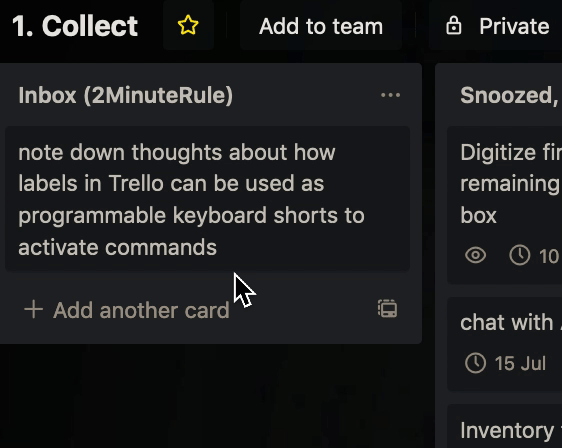

I'm a fan of the keyboard. And I'm a fan of not doing tedious, repetitive actions.

And I very much enjoy using Trello as my dashboard.

What had started as my hack to easily move Cards around Trello is actually a pretty flexible way to apply custom workflows to keyboard shortcuts.

Let's say, I'd like to move a Card from the board which stands in as my inbox, to the board which I use to focus on only the stuff I'm doing today. And let's say this Card had a due date, and I'd like to remove it when I move the card to the other board.

Moving Cards between boards is something I do more than a handful of times each day. For each move to do everything I listed earlier, it would take 8 clicks, a bunch of scrolling, and some searching with my eyeballs. Along with the chance that I make mistakes and click the wrong place, send the card to the wrong list － the touchpad can be very imprecise at the end of a long day.

Or I could use Trello's handy keyboard shortcut to add labels to cards. And connect the action of adding the label to a card as a trigger for a multi-step workflow, like the one above.

So now when I hover over a card, and press 1, the green label that gets added then triggers the following:

1. Find a specific list on another board
2. Move the Card to that list
3. Remove the due date (if any)
4. Remove the green label (clean up, the label's only purpose is as a trigger)

To replicate this keyboard shortcut-based trigger, you'll need the Powerup called Butler, formerly Butlerbot for Trello.

---

📡 _This blog has an RSS feed: https://manil.space/rss.xml_

💬 _Thanks for reading all the way through! Let me know what you think. You can (at)me on [Mastodon](https://toot.cafe/@manil) or [Twitter](https://twitter.com/keywordnew)_.

🤝 _Looking for a consult? Request a connection using [this handy form](https://manil219750.typeform.com/to/tu4vPj). It's handy because you don't have to think of what to write in an email. Just fill out the form, I will email you_ ;-)