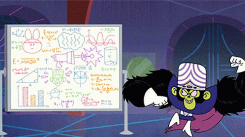

_Originally [posted in this newsletter](https://buttondown.email/calm-productivity/archive/818011dc-ef4a-462b-b73c-a7768c168e6b)._

## How lists lose their fizz

You are a person who relies on the usefulness of lists. 

So you're using something to make lists of what you plan to do, read, or buy. This list could be in a notebook, an app, or one of those listening machines which you teach to do your bidding. (Or is it the other way around? Alexa, give me purpose.)

Among my lists, I have a one where I save all content (text, audio, or video) for later. But I've never gotten that list to zero.

Does a list of longstanding items prevent me from getting shit done? _No, it does not._ But those items in my list which I always skip are not doing me any good. That video from last year's newsletter is like a shirt in the back of my closet － I want to wear it, but let's be realistic: I'm never putting it on. Often, these items make me feel guilty, and many more times they make me feel overwhelmed with all the clutter.

## When it's time to wipe your lists 🧘🏽‍♀️

 

I've had the same Pocket account since 2009 (when it was called Read it Later). I rarely browse and read at the same time. I prefer to save then read, later. Over the years, I've consumed a lot of content.

Last week, I decided to create a new Pocket account. It was a last ditch solution to an issue where Pocket's share feature won't forget emails I've shared to in the past. It's too easy to accidentally share with people I have no intention of sharing with. The new account has no share history. It has no history at all. I have a blank slate.

This is, unintentionally, almost like what I did to my email when I first decided to target Inbox Zero. I archived everything that was more than a day old. I gave myself a fresh start.

And it felt fucking liberating.

There was no single critically important email that I missed. I expect the same to be true for most of my lists.

And because I felt less overwhelmed by the backlog, I actually got through more of what I wanted to do.

I need to remember that my eyes are bigger than my stomach. I tend to take on more than I can handle. This manifests as too many videos to watch, spreading myself so thin I can't handle the email load, or taking on too many tasks in a day. Enthusiasm is not a problem, as long as I recognize this and keep my lists in check.

💬 Thanks for reading all the way through! Let me know what you think. You can (at)me on [Mastodon](https://toot.cafe/@manil) or [Twitter](https://twitter.com/keywordnew).

---

📡 _This blog has an RSS feed: https://manil.space/rss.xml_
