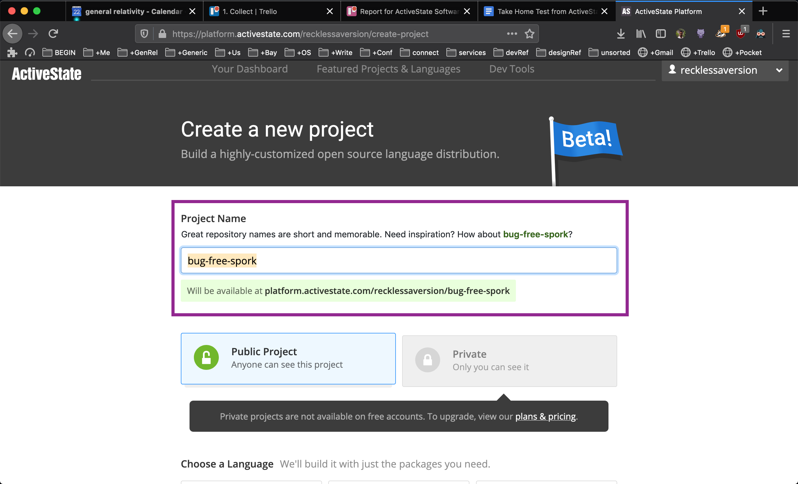

[ActiveState](https://activestate.com) let me build a custom runtime for Python, without much upfront investment. They also support Perl and Tcl. Products like the ActiveState Platform make work easier for developers in security and legal compliance. 

## About Friction Logs

A friction log is a narrative of what you as a user do with a developer product. It includes any reactions had while working through a use case. It tells the story of the full developer experience (DX) from start to finish. It’s excellent at converting user empathy into product improvements.

### Key

✅ delightful, worked out of the box, no extra configuration

⚠️ frustrating

❌ if I have a choice, this is where I ditch

## Scenario: Build a project on the ActiveState service that creates a Python language runtime

1. Go to [ActiveState Platform](https://platform.activestate.com/): I searched for “activestate platform” on DuckDuckGo because developers are more than 3 times more likely to use a search engine (rather than type in URL) to find the resource they need. The correct URL was the top result. ✅
2. [Create an account](https://platform.activestate.com/create-account): I appreciate multiple options to sign in, and always choose email. ✅
3. [Initiate a project](https://platform.activestate.com/create-project): Was easy to see how to start. The “Build a Custom Runtime” button is blue and distinctive from the rest of the grey-themed page. ✅
4. Name the project: I’m helpfully informed that the name I choose also becomes part of the URL. This creates a sense that this step is more important and encourages me to slow down. **There’s no reason to burden the developer at this stage, if they haven’t reached this step with a name in mind.** I’d suggest adding a feature to prefill the field with random yet entertaining strings. This implies a more encouraging impression: don’t worry, ActiveState is easy to use, these can be changed later. See screenshots below. ⚠️ 

_I’ve always found the [random name generator](https://github.com/new) to be one of GitHub’s small, delightful features. (above) Manil’s bad version mockup: a similar feature for the ActiveState Platform_ ;-)

5. Choose a language: I picked Python, as asked for in the scenario. v3.6.6 is the default. **It’s not clear why this version is the default.** On opening the dropdown I see both newer and older versions are available. Usually the newest or LTS is the default. I was warned that my combination may fail. But I want to be successful! Is this version being preselected for me because it’s most likely to be successful? ⚠️ 
6. Choose an operating system: I like how MacOS is shown but greyed out. This encourages developers on MacOS like myself to continue and play around if they have access to a Linux/Windows machine. It’s implied they’ll soon have support too. ✅
7. Create a project: The button that displayed after I checked at least one OS took me to the Configuration tab of my project. This is helpful if my purpose is to customize the build. **But this page doesn’t tell me the current status of my build.** To see that information, I have to go to Overview or Download Builds. On top of that, If I’m still on the Configuration page when the build is complete, I’m not given any notification. This is a missed opportunity to celebrate a small win with the dev: the build completed, fantastic! ⚠️

## Final thoughts

With a few exceptions that caused confusion and/or frustration, I found the service easy to use. I created a custom Python runtime successfully, and it left me with a good impression.
