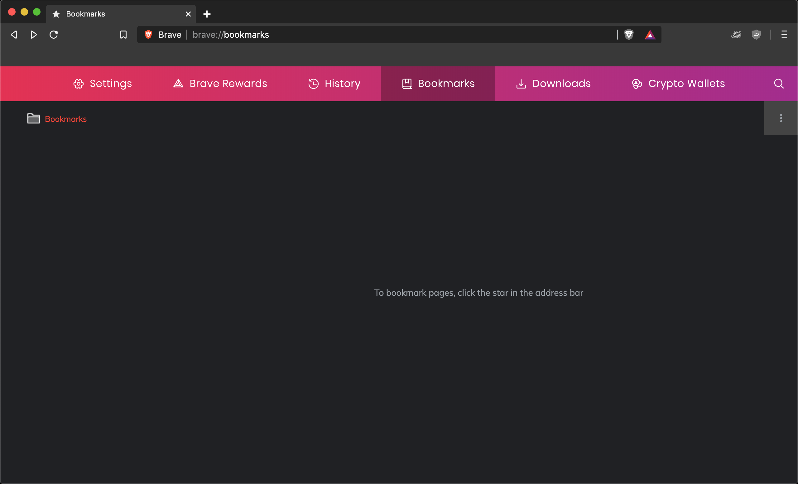
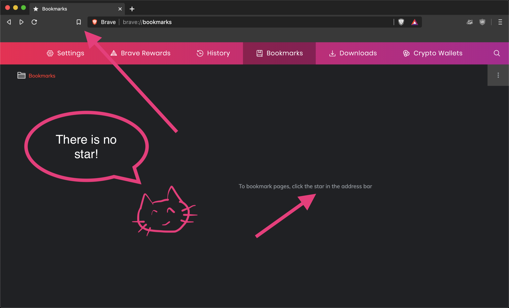
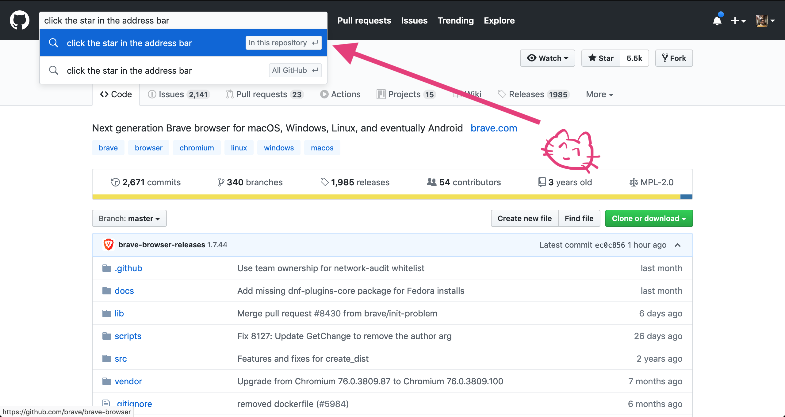
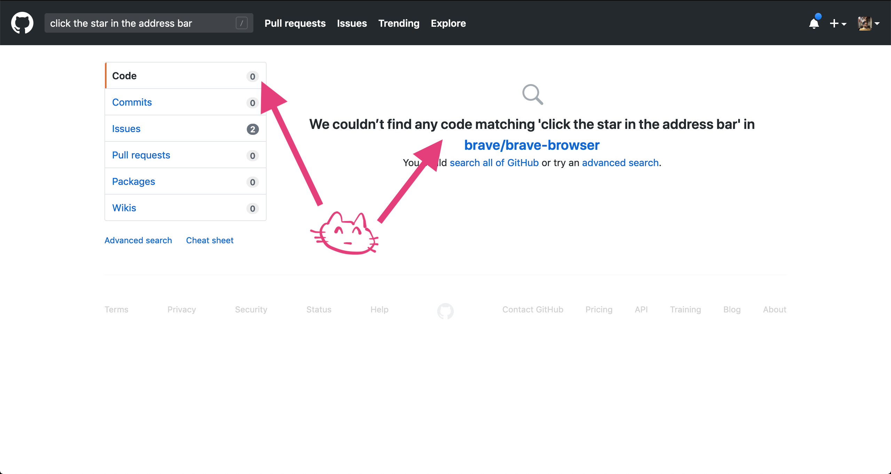
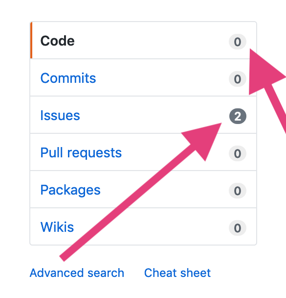
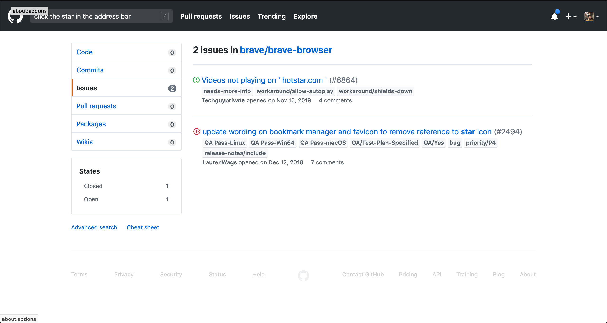

## The itch

Today I spotted something odd in a new browser.

You don't see it, yet? Totes understandable. I noticed only because this is a fresh install and I haven't yet brought in all my junk. Here, I'll help.

Brave uses a lot of source code from the [Chromium project](https://www.chromium.org/). That's the same open source project from where Google Chrome gets much of its source code. In Chromium and Chrome, the UI for bookmarks uses stars. Brave's UI uses, well, bookmarks. And, if I'm being fussy, the button is no longer _in_ the address bar. In Brave, it's been moved out and to the side.

The problem was a tiny thing. But my curiosity about how the Brave project works won out, and I decided to peek under the hood. There was also a chance that the discrepancy had gone unnoticed for a long time. Many people import their bookmarks from another browser, and if you do that, you won't see the broken message. At minimum, I could create an Issue and document this.

## Why we peek

From [a year of running "Getting Started in Open Source" workshops](https://www.meetup.com/nodeschool-vancouver/events/past/), I've learned there are many motivations for people who start contributing open source. One of those reasons is tracking down problems with something we use.

I _am_ curious about how stuff I use is made: the process and the implementation. But it's typically something being broken that actually drives me towards the source code. [Monica](https://github.com/monicahq/monica/), [Buttercup](https://github.com/buttercup/buttercup-desktop), and [Gatsby](https://github.com/gatsbyjs/): all open source, all products where I could scratch my own itch. (That's a metaphor, scratching actual itches is not recommended. Scratching irritates the skin more, and makes the itch worse. It's a vicious cycle.)

I wanted to know about how the Brave project was set up. Updating a string needs knowledge of the process more than it needs knowledge of the stack. So, if I could find out how, I'd put in a fix.

## Pulling back the curtain a bit

That we can get visibility into the making of products we use is a wonderful reason for certain products to be open sourced.

My process of digging typically looks like this:

1. **Find out where Brave keeps its source code**: Going to [their website](https://brave.com/features/) would have been a good choice. It's probably in the footer, they're very vocal about the browser being open-sourced. But I was lazy, I used a search engine. I figured they'd either be using Github or GitLab, so I started with ["brave github"](https://duckduckgo.com/?t=ffab&q=brave+github&ia=web), and the first result got me to their [GitHub organization](https://github.com/brave/).
2. **Which repo?** The Brave team have 150 public repos! But they, very helpfully, pinned the important ones. Right up top is the repository for the [Brave browser](https://github.com/brave/brave-browser).
3. **Search for the string in the repo:** I looked for the string in the repo code. Seemed the fastest way to find the right part of the source. 

But there was no result. This is me baffled. Where do they keep those messages?

But, there _were_ hits for that string in Issues.

4. Find existing Issues: When possible, don't open duplicate Issues.

So I bite. The first hit is irrelevant. But the second one is right on the money 💸.

I see that a collaborator opened [Issue #2494](https://github.com/brave/brave-browser/issues/2494) for exactly the same reason I'd come here. Wonderful!

The [Issue description](https://github.com/brave/brave-browser/issues/2494#issue-390341545) is very thorough, and even includes screenshots. Bloody exemplary 💯. Sometimes we skip screenshots, when something seems trivial, even when we know it's best practice for anything that involves UI. But here is a great example why it's worth following open source development best practices. Over a year after the collaborator created this Issue, I'm being helped out by their efforts.

I'm def not the first person to think about tracking this down. So much for "unnoticed" 😂. But the Issue is from way back in late 2018. Has it stalled?

## Progress of Issue #2494, in short

As I scroll down, I see that the Issue was added to a backlog tracker, deprioritized, reprioritized, moved around a project board. I learned that [this repo uses the Projects](https://github.com/brave/brave-browser/projects) feature to organize its work.

* Within a few months of the issue being opened, another collaborator commented the copy with which to replace the obsolete text: ["To bookmark pages, click the bookmarks button next to the address bar."](https://github.com/brave/brave-browser/issues/2494#issuecomment-463367371). 
* A collaborator suggested also [changing the favicon for the Bookmarks Manager](https://github.com/brave/brave-browser/issues/2494#issuecomment-494114305). Issue screenshot shows it to be a star, like Chromium. I'm seeing the same in Brave 1.4.96.
* A contributor [confirmed the copy](https://github.com/brave/brave-browser/issues/2494#issuecomment-494955088). 
* Over a year after the issue was opened, yet another collaborator [made a PR](https://github.com/brave/brave-core/pull/4356) that fixed the issue. The PR was made in a different repo,  [brave-core](https://github.com/brave/brave-core). The string lives there, in [this file](https://github.com/brave/brave-core/blob/d4184df9d2d16cdf08f284b0ccfca31a2497ed81/app/brave_generated_resources.grd). Seems like brave-core holds all the changes that turn Chromium into Brave.

## If you're looking to jump in

I usually give people 3 things with which to get started in an open source project.

* **Code of Conduct**: I couldn't find a Code of Conduct for brave-browser. [There was one](https://github.com/brave/muon/blob/master/CODE_OF_CONDUCT.md) for [brave-muon](https://github.com/brave/muon) (from before they switched to basing off of Chromium). Someone even tried to [open a discussion](https://github.com/brave/browser-laptop/issues/1771#issue-154918317) about it in a diffent repo.
* **Contributor guide**: These should have everything a new contributor needs to get started. Here is [Brave's](https://github.com/brave/brave-browser/blob/master/CONTRIBUTING.md). It's quite thorough: it suggests different ways to contribute (people are often surprised by how many there can be), process guidance (don't assume people know your branching conventions, without being told 😜), etc.
* **Good first issues**: This is a label that is conventionally added to Issues that need less insider knowledge to help resolve. Use this [filter](https://github.com/brave/brave-browser/issues?q=is%3Aissue+is%3Aopen+sort%3Aupdated-desc+label%3A%22good+first+issue%22) to see open Issues in brave-browser that are marked as good for first timers. 

_Thanks for reading all the way through! Let me know what you're thinking about. You can @me on [Twitter](https://twitter.com/keywordnew) or [Mastodon](https://toot.cafe/@manil)_.

_Looking for help? Request a connection using [this handy form](https://manil219750.typeform.com/to/tu4vPj). It's handy because you don't have to think of what to write in an email. Just fill out the form, and it comes straight to me ;-)_