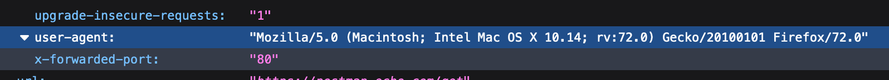

And so begins my year of shallow-deep dives into APIs on the web.

I've taken on a role of advocating for API best practices in my organization. A non-trivial part of this will be educating people about APIs.

So I started evaluating Postman as a learning tool for using APIs. I discovered their documentation, which is [open-sourced](https://github.com/postmanlabs/postman-docs/blob/develop/src/pages/docs/postman/launching-postman/sending-the-first-request.md) :-) I'll be using their docs to get familiar with Postman.

## 🔍 What are HTTP headers?

HTTP headers are extra information being passed between the client (usually the browser) and server.

So what information can this be? We've got a bunch of examples from the HTTP response above to get started.

## 🙌🏽 Getting hands on with API education

The first step of the docs have me sending a GET request to a server that sends back a response in JSON.

I made the GET request to this URL: `postman-echo.com/get`

And the JSON response I got back looked like this:

```
{
    "args": {},
    "headers": {
        "x-forwarded-proto": "https",
        "host": "postman-echo.com",
        "accept": "*/*",
        "accept-encoding": "gzip, deflate",
        "cache-control": "no-cache",
        "cookie": "sails.sid=s%3AERErjpcSFmbnOXQDKaSCj0J7fPq-UFcF.vQ8SaQQUOJ5Baj6580kac81CAJW1nGSZlm%2B8bOV1fTs",
        "postman-token": "acc19e6d-fdb8-4722-aea5-042408d96330",
        "user-agent": "PostmanRuntime/7.21.0",
        "x-forwarded-port": "80"
    },
    "url": "https://postman-echo.com/get"
}
```

What are these headers that are being sent back to me by the server? What are these used for?

### ```"x-forwarded-proto": "https"```

This shows the protocol of my original GET request. 

The server may receive a request in `HTTP` even if my GET request is made with `HTTPS` because of a load balancer or proxy sitting in between myself and the server. The response helpfully preserves this information using the `x-forwarded-proto` header.

This header is a non-standard. It is a widely-used convention that is now  standardized using the `Forwarded` header. Use `Forwarded` when you can.

### ```"host": "postman-echo.com"```

This shows the domain name of the server to which we made the GET request.

It can also include the listening TCP port number but this is dropped if the port used is the default for the service requested (like here). For example, an HTTP URL will use port 80 by default. So even if it would read `postman-echo.com:80`, it just reads `postman-echo.com`.

### ```"accept": "*/*"```

This is what the client uses to tell the server which content types it can understand. `*/*` means "I can understand any content type". A MIME type or media type is the format of a file. MIME types include `text/plain` for `.txt`, `font/ttf` for True Type Fonts, and `image/svg+xml` for SVGs.

When I see `.js` files in a project, I understand that I'll need to put on my JavaScript hat to work with it. In the same way, browsers use MIME types (not file extensions) to understand how to work with a URL.

### ```"accept-encoding": "gzip, deflate"```

This tells the server which compression algorithms the client can understand. And yes, DEFLATE is a compression algorithm, not an instruction for handling `gzip`s.

### ```"cache-control": "no-cache"```

This is an instruction for caching. 

`no-cache` means the browser can cache _but_ needs to reconfirm before using the cached resource. 

So an HTTP request for the resource happens every time, but the browser can skip downloading the HTTP body if the server says the cached copy is still valid. I would get the same effect using a value of `max-age=0`.

### ```"cookie": "sails.sid=some-name-here"```

This contains stored HTTP cookies.

### ```"postman-token": "acc19e6d-fdb8-4722-aea5-042408d96330"```

This is a Postman-specific header used to workaround a Chrome browser-specific bug. 

Enough said.

### ```"user-agent": "PostmanRuntime/7.21.0"```

This tells the server more about the client making the request. In this case, the client is the Postman Runtime. 

When I use the Firefox browser to send the same GET request to the server, my user-agent shows up as:



### ```"x-forwarded-port": "80"```

This is a non-standard header showing the port.

## 🏆 Going further

Mozilla has [excellent resources](https://developer.mozilla.org/en-US/docs/Web/HTTP/Headers) about HTTP headers.